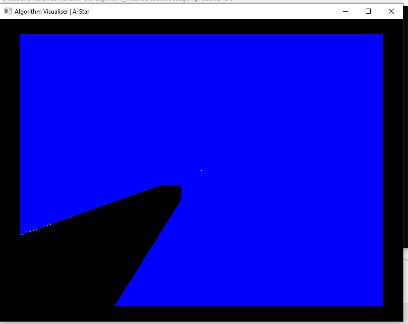
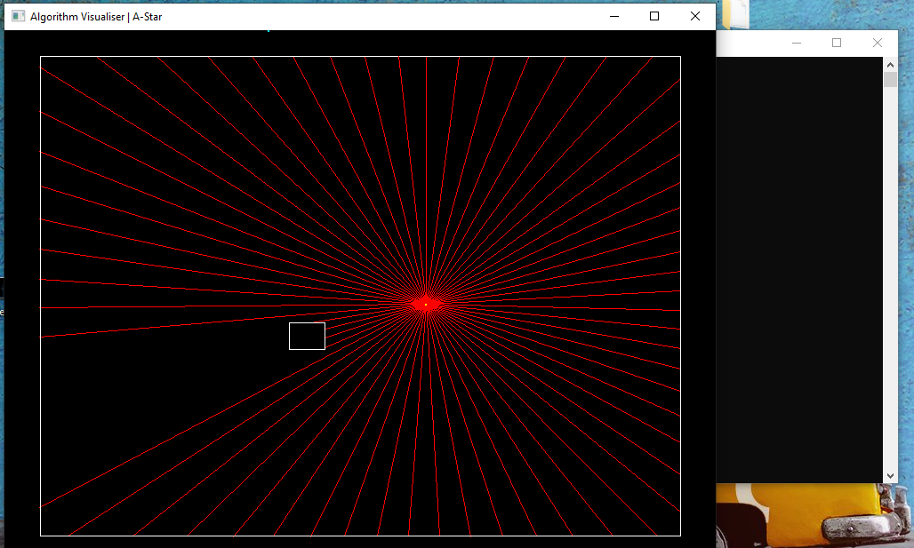
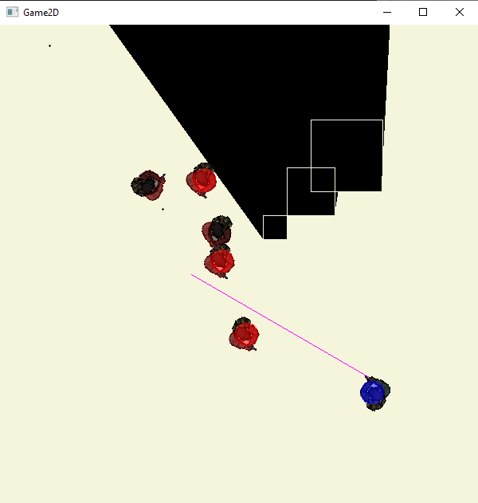
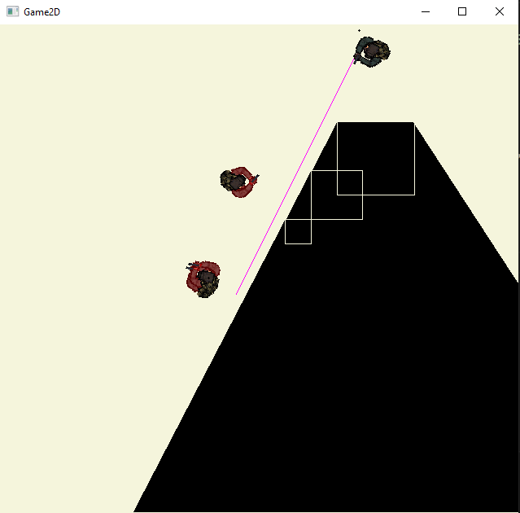

# Game2D

- Windows 7+

===========================

Stopped work on porject in 2020. Here are some images to show what was acheived.

First stages of line-of-sight in game: Screen is blue where the player can see, and black where their line of sight is blocked.

Another early stage of development that displays line segments that intersect with objects in the game to find line of sight.

The player (Blue) and emeny (red) hitboxes (for object collission detection and for damage calculations).

The player and emenies within the game.

===========================

			/* TODO create new object when moving polygon (delete etc.) */
			
			remove error checking code from main loop -> keep contained inside functions and handle errors

https://www.youtube.com/watch?v=443UNeGrFoM&list=PLZC-59zhyb1JS3uB-TgH2IVbJmYUNpX2n&index=5&t=2276s

name vars:

handle     ->  SHandle, ...
manager
controller

1:47:00 :
struct MyStruct
{
uint length;
uint8 data[];  // or data[1] and then (length - 1) ...
}

struct MyStruct a* = malloc((sizeof *a) + sizeof(uint8) * length);
a->length = length;

for (int i = 0; i < length; i++)
	a->data[i] = 0;
	
{next}
CAREFUL ABOUT ALIGNMENT DANGEROUS
struct A{...} struct B{...}
struct A* a;
struct B* b;
a = malloc(sizeof(struct A) + sizeof(struct B));
b = (struct B*)&a[1];

{next}
functions + stride (FOR RGB / RGBA)

{further}
UI states/input/ids etc.

{sqrt approximation @ 2:08:00}
>>>>>GOOGLE IT

https://ncase.me/sight-and-light/
https://www.redblobgames.com/articles/visibility/

## TODO refactoring

https://www.parallelrealities.co.uk/tutorials/shooter/shooter1.php

- remove dynamic gp_g2d_window ...

- blit?
- dx, dy ... for movement
- MAYBE have type renderable where magic is done to render with RECT and TEXTURE structs
-    sprite header type
-	 https://www.youtube.com/watch?v=443UNeGrFoM&list=PLZC-59zhyb1JS3uB-TgH2IVbJmYUNpX2n&index=5&t=2276s
-    1:14:00

https://stackoverflow.com/questions/63438157/convert-polygon-to-inverted-polygon-i-e-carve-out-the-negative-polygon-from-vi
		
## TODO

- POS_OFFSET_X ... CHANGES AIM ORIGIN NOT SPRITE POS

- move polygons by clicking on center
- function to create polygons -> go on to allow user to create their own

- draw text

- debug/logging function

- enemies smooth disappearing

- improve sprite drawing performance?
	-> performance in general
